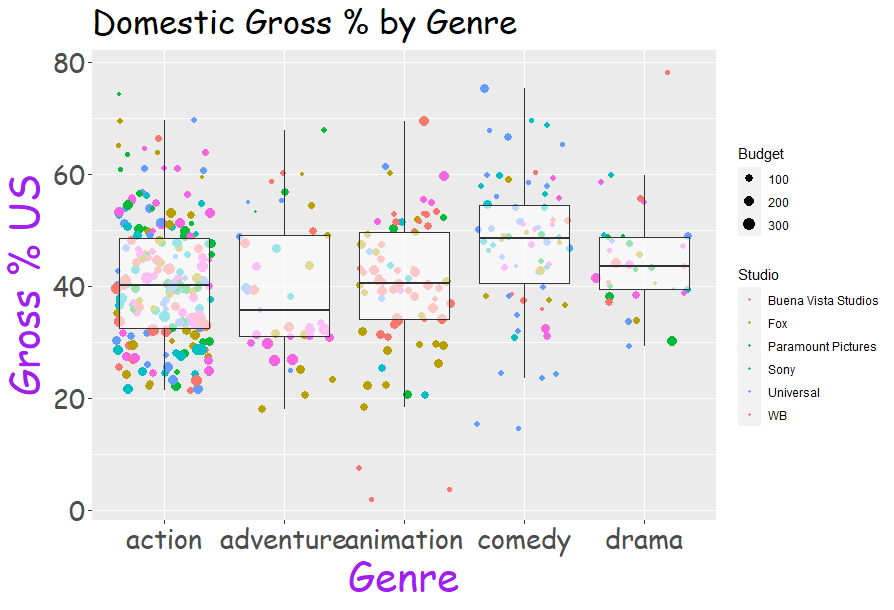

# Exam explanation
## Title page
 **TECNOLÓGICO​ ​NACIONAL​ ​DE​ ​MÉXICO** 

**INSTITUTO TECNOLÓGICO DE TIJUANA**

**SUBDIRECCIÓN ACADÉMICA**

**DEPARTAMENTO DE SISTEMAS Y COMPUTACIÓN**

**SEMESTER: August - December 2020**

**CAREER: Computer Systems Engineer**

**SUBJECT: Data Mining**

**TITLE: Evaluation Practice Unit 2**

**UNIT TO BE EVALUATED: Unit 2**

**STUDENT NAMES AND CONTROL NUMBERS:**

**Moreno Ramos Emanuel - 16212046**

**Quiroz Vega Irving Arael - 15210341**

**TEACHER NAME:  JOSE CHRISTIAN ROMERO HERNANDEZ** 

## Exam

Develop the following problem with R and RStudio to extract the knowledge that the problem requires.

The managers of the movie review website are very happy with their previous installment and now they have a new requirement for you.

The previous consultant had created a graph for them, however the R code used to create the graph has been lost and cannot be recovered.

Your task is to create the code that will recreate the same table making it look as close to the original as possible.
You will be provided with a new data set.

Clue
- Note that not all Genres (Genre) and studios (Studio) are used.
- You will need to filter your dataframe after importing the csv file.

The csv are in this folder [csv](./exam/Project-Data.csv)

In the archive [exam2.R](exam/exam2.R) are the code.

## Code explain

First, you must modify the path where you will work so that it is more convenient to call the csv file.

``` R
getwd()
setwd("D:\Usuarios\Emanuel\Documentos\github\datamining\unit2\exam")
getwd()
```
csv file is read and assigned to movies.
```R
movies <- read.csv("Project-Data.csv")
```

the first data is shown to see how the csv is created.
```R
head(movies)
```

A dataframe is created with the Genre, Budget, Gross and Studio columns, in order to later filter the data that will be used.

```R
dataset_movies <- data.frame(Genere = movies$Genre,Budget = movies$Budget...mill.,Gross = movies$Gross...US,Studio=movies$Studio)
```
The first data from the dataset we just created is displayed.
```R
head(dataset_movies)
```
We call this library that will allow us to create filters more easily.
```R
library(dplyr)
```
A dataset is created that stores the data filtered by genre of the previously created dataset, having to be action, adventure, animation, comedy and drama.
```R
dataset_filter_genere <- filter(dataset_movies, dataset_movies$Genere == 'action' | dataset_movies$Genere == 'adventure' | dataset_movies$Genere == 'animation' | dataset_movies$Genere == 'comedy' | dataset_movies$Genere== 'drama')
```
The first data is displayed to see that the filter has worked.
```R
head(dataset_filter_genere)
```
Another dataset is created that now filters the previously filtered dataset to filter now by studio, being from Buena Vista Studios, Fox, Paramount Pictures, Sony, Universal and WB.
```R
dataset_filter_studio <-filter(dataset_filter_genere,dataset_filter_genere$Studio == 'Buena Vista Studios'|dataset_filter_genere$Studio == 'Fox'|dataset_filter_genere$Studio == 'Paramount Pictures'|dataset_filter_genere$Studio == 'Sony'|dataset_filter_genere$Studio == 'Universal'|dataset_filter_genere$Studio == 'WB')
```
The first data of the last filtered dataset is displayed.
```R
head(dataset_filter_studio)
```
The datasets created for the first filters and the original dataset are cleaned up to save space.
```R
rm(movies,dataset_movies,dataset_filter_genere)
```
The ggplot2 library is called, which will allow us to plot.
```R
library(ggplot2)
```
Because it was made in Windows, R requires that the font we will use is called.
```R
windowsFonts(Comic=windowsFont("Comic Sans MS"))
```
u is assigned to graph the dataset we filter, as well as to take the X axis to the genre of the film and the Y axis to gross sales.
```R
u <- ggplot(dataset_filter_studio, aes(x=Genere, y=Gross))
```
After the previous assignment, now hj is assigned the u which is the one that contains the information to be plotted to draw the graph of points indicating that small points should be placed, the studies by color and their size by box office, as well as add a box plot that is 0.6 transparent, so we can see the points.
```R
hj <- u +  geom_jitter(shape=20,aes(color=Studio, size=Budget)) + geom_boxplot(alpha=0.6,outlier.shape = NA)
```

Finally, aesthetic arrangements are made to the graph, adding the labels of the XY axis, title, and the theme that these letters will have, indicating what color, font and size will be the labels, title and texts of the graph.
```R
hj + xlab("Genre") +
ylab("Gross % US") +
ggtitle("Domestic Gross % by Genre") +
theme(axis.title.x = element_text(color = "Purple", size=30),axis.title.y = element_text(color = "Purple", size=30),axis.title = element_text(family = "Comic"),axis.text.x = element_text(size = 20),axis.text.y = element_text(size = 20),axis.text = element_text(family = "Comic"),plot.title = element_text(color = "Black",size = 25,family = "Comic" ))

```
The Graph is this:



## Conclusion
You can see that in the action genre is where there is more money, although the 300 million is not always generated, the studio that produces the most is Paramount, Sony and WB, in addition to that the income of the United States is between 30 and 50%.

In adventure there are more than 300 million points, but they are mostly below 40% of income in the United States, with WB being the one who produces the most films of this type.

For animation, most of it is produced by Buena Vista Studios, having revenues of 200 and 300 million, in addition to being between 30 and 50% of income in the United States.

In comedy there are few films that reach 300 million, but most make between 40 and 60 their income in the United States and are mainly produced by Sony.

For drama there are few films, having at least 3 films that have reached 300 million, in addition to that between 40 to 50% of income is generated in the United States, they are produced by Paramount Pictures, WB and Universal.