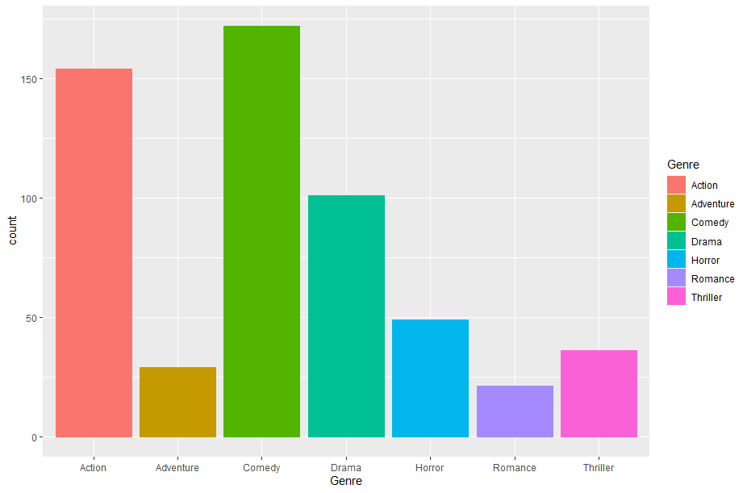
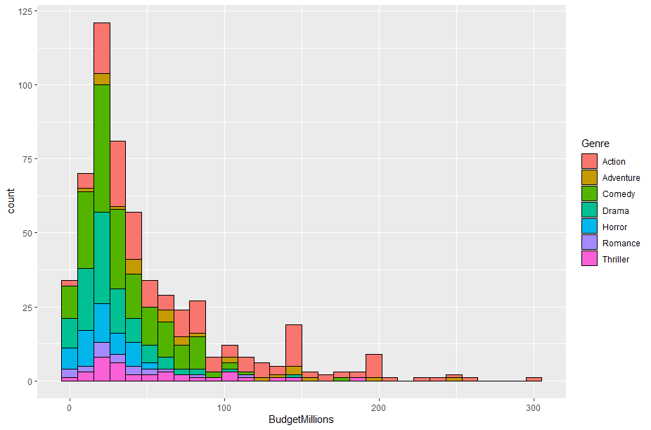
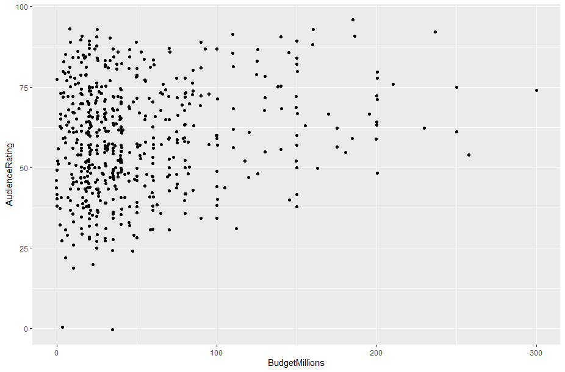
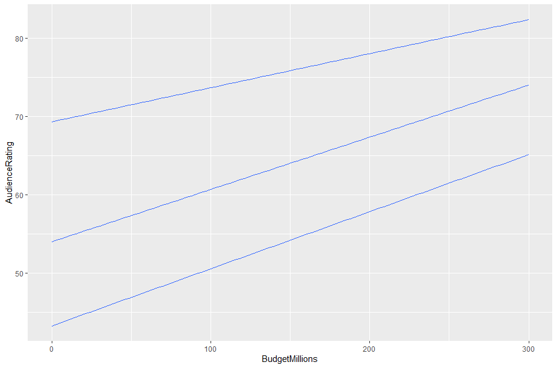
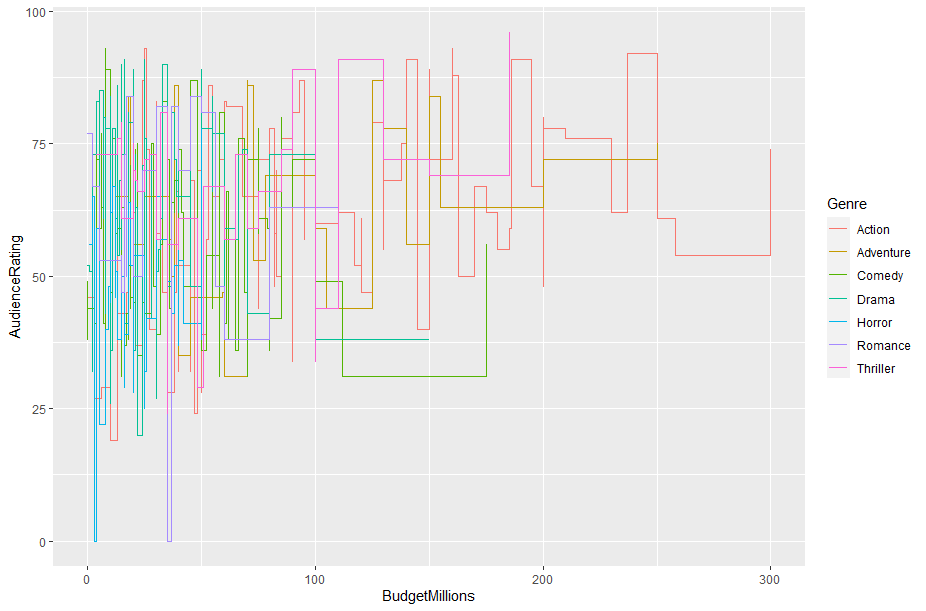
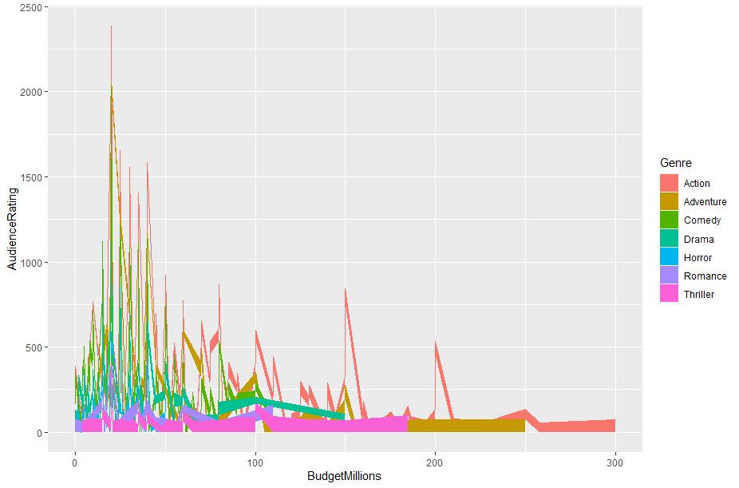

# practice 1

Investigate 5 functions of geometry that can be added to the ggplot2() function

## Bar chart

In order to display data that is of discrete variables, such charts are used, you need to indicate only one x-axis in order to be drawn.

```R
example2 <- ggplot(data-movies,aesmovies,aes(x-Genre,color-Genre,fill-Genre))Genre,color=Genre,fill=Genre))
example2 +  geom_bar()
```


**Values that can be edited:**
- X
- alpha
- Color
- fill
- linetype
- size
- weight

## Histogram
In the histogram the surface of each bar is proportional to the frequency of the represented values, for this it is responsible that the variable is continuous.

```R
example3 <- ggplot(data-moviesmovies, aes(x-BudgetMillions,binwidth-30,fill-Genre))BudgetMillions,binwidth   30,fill=Genre))
example3 +  geom_histogram(color-"Black""Black")
```



**Values that can be edited:**
- X
- And
- alpha
- Color
- fill
- linetype
- size
- weight

## Jitter
It is a diagram where each value is drawn with points.

```R
example4 <- ggplot=(data-moviesmovies, aes(x-BudgetMillions,y-AudienceRating,binwidth-30))BudgetMillions,y 30))
example4 +  geom_jitter() AudienceRating,binwidth  
```



**Values that can be edited:**
- X
- And
- alpha
- Color
- fill
- shape
- size

## Quantile

A Q-Q chart ("Q" comes from quantile) is a graphical method for diagnosing differences between the probability distribution of a population from which a random sample has been extracted and a distribution used for comparison.

```R
example4 <-= ggplot(data-moviesmovies, aes(x-BudgetMillions,y-AudienceRating,binwidth-30))BudgetMillions,yAudienceRating,binwidth   30))
example4 +  geom_quantile()

```


**Values that can be edited:**

- X
- And
- alpha
- Color
- linetype
- size
- weight

## Steps

A step chart is a special type of line chart that consists of lines at various horizontal intervals or "steps".

```R
example4 <- ggplot(data-moviesmovies, aes(x-BudgetMillions,y-AudienceRating,color-Genre))BudgetMillions,y=AudienceRating,color=Genre))
example4 +  geom_step()

```



**Values that can be edited:**
- X
- And
- alpha
- Color
- linetype
- size

## Area
An area chart is a specialized form of the line chart, where instead of simply connecting our data points to a continuous line, we also fill the region below that line with a solid color.

```R
example4=<-= ggplot(data-moviesmovies, aes(x-BudgetMillions,y-AudienceRating,color-Genre,fill-Genre))BudgetMillions,yGenre,fill=Genre))
example4 +  geom_area() AudienceRating,color

```


**Values that can be edited:**

- X
- And
- alpha
- Color
- fill
- linetype
- size

# References
Data display with ggplot2. (2020). Retrieved  9  November  2020,  from  https://rstudio.com/wp-content/uploads/2015/04/ggplot2-spanish.pdf