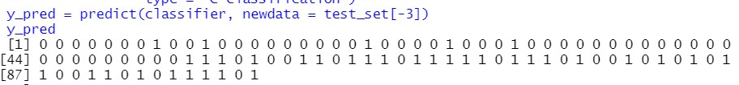
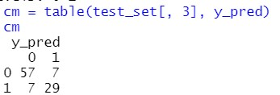
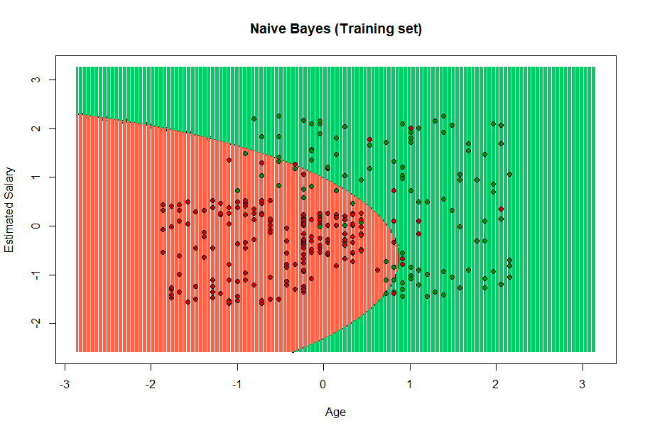
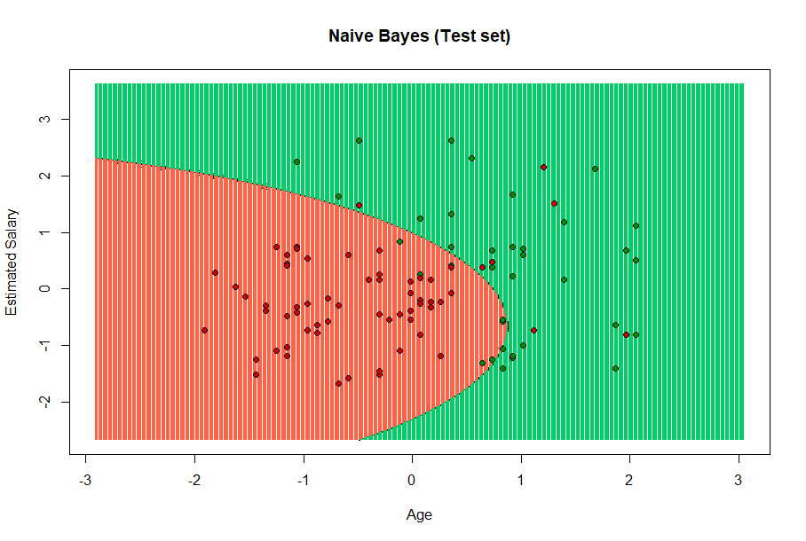

# Exam explanation
## Title page
 **TECNOLÓGICO​ ​NACIONAL​ ​DE​ ​MÉXICO** 

**INSTITUTO TECNOLÓGICO DE TIJUANA**

**SUBDIRECCIÓN ACADÉMICA**

**DEPARTAMENTO DE SISTEMAS Y COMPUTACIÓN**

**SEMESTER: August - December 2020**

**CAREER: Computer Systems Engineer**

**SUBJECT: Data Mining**

**TITLE: Evaluation Practice Unit 3**

**UNIT TO BE EVALUATED: Unit 3**

**STUDENT NAMES AND CONTROL NUMBERS:**

**Moreno Ramos Emanuel - 16212046**

**Quiroz Vega Irving Arael - 15210341**

**TEACHER NAME:  JOSE CHRISTIAN ROMERO HERNANDEZ** 

## Exam

### Introduction
Bayesian networks, along with decision trees and artificial neural networks, have been the three most used methods in machine learning in recent years in tasks such as document classification or email message filters. It is an important method not only because it offers a qualitative analysis of the attributes and values ​​that may intervene in the problem, but because it also accounts for the quantitative importance of those attributes.

In this unit we saw other methods of machine learning, but for this evaluation practice we will use Naive Bayes, which will be explained and then the respective code will be shown.

### Developing
Develop the following problem with R and RStudio to extract the knowledge that the problem requires.
Implement the Naive Bayes classification model with the Social_Network_Ads.csv data set and using the e1071 library with the naiveBayes () function. Once the classifier is obtained, do the corresponding data visualization analysis.

At the end of the development, explain in detail what the Naive Bayes classification model consists of and also the detailed explanation corresponding to data visualization.

### Naive Bayes
Naïve Bayes or Naive Bayes is one of the simplest and most powerful algorithms for classification based on Bayes' Theorem with an assumption of independence between the predictors. Naive Bayes is easy to build and particularly useful for very large data sets.

These models are called "Naive" algorithms, or "Innocents" in Spanish. They assume that the predictor variables are independent of each other. In other words, that the presence of a certain feature in a data set is not at all related to the presence of any other feature. They provide an easy way to build very well behaved models due to their simplicity.

They do this by providing a way of calculating the 'later' probability of a certain event A occurring, given some probabilities of 'earlier' events.
A naive Bayes classifier considers that each of these characteristics contributes independently to the probability that this fruit is an apple, regardless of the presence or absence of the other characteristics.
An advantage of the naive Bayes classifier is that only a small amount of training data is required to estimate the parameters needed for classification (the measures and variances of the variables).

It is only necessary to determine the variances of the variables of each class and not the entire covariance matrix. For other probability models, naive Bayes classifiers can be trained in supervised learning settings.

### Code explain

First the route is indicated to know where to work.
```R
getwd()
setwd("D:/Usuarios/Emanuel/Documentos/github/datamining/unit3/exam")
getwd()
```
Then, the [csv](./Social_Network_Ads.csv) with which we are going to work is imported, indicating that we will only use column 3,4 and 5
```R
dataset = read.csv('Social_Network_Ads.csv')
dataset = dataset[3:5]
```
The purchase column is converted to factor, indicating which levels you will obtain.

```R
dataset$Purchased = factor(dataset$Purchased, levels = c(0, 1))
```
The dataset is divided with catools, indicating that we want the division to be 0.75, with this it is saved in a training dataset and a test one.
```R
library(caTools)
set.seed(123)
split = sample.split(dataset$Purchased, SplitRatio = 0.75)
training_set = subset(dataset, split == TRUE)
test_set = subset(dataset, split == FALSE)
```
The matrices are scaled to make them centered.
```R
training_set[-3] = scale(training_set[-3])
test_set[-3] = scale(test_set[-3])
```
It adapts the data of the dataset to naive bayes, this works by indicating which columns are used, which dataset and what type of classification, this is done with the e1071 library.
```R

library(e1071)
classifier = naiveBayes(formula = Purchased ~ ., data = training_set, type = 'C-classification')
```
Results are predicted with the test set.
```R
y_pred = predict(classifier, newdata = test_set[-3])
y_pred
```
A confusion matrix is ​​made to see how much error the system made.
```R
cm = table(test_set[, 3], y_pred)
cm
```
Now the results are displayed. For this, the elemstatlearn library is used.
```R
library(ElemStatLearn)
```
The training set is passed to a variable.
```R
 set = training_set
```
The area where it is going to be graphed is created, indicating the minimum value and the area of ​​the grid.
```R
X1 = seq(min(set[, 1]) - 1, max(set[, 1]) + 1, by = 0.01)
X2 = seq(min(set[, 2]) - 1, max(set[, 2]) + 1, by = 0.01)
grid_set = expand.grid(X1, X2)
```
It is indicated which columns will be taken into account for the graph.
```R
colnames(grid_set) = c('Age', 'EstimatedSalary')
```

A prediction is made with the adaptation previously made
```R
y_grid = predict(classifier, newdata = grid_set)
```
It is graphical indicating the title, labels of the x-axis and y-axis, as well as setting the limits of X and Y.
```R
plot(set[, -3],
     main = 'Naive Bayes (Training set)',
     xlab = 'Age', ylab = 'Estimated Salary',
     xlim = range(X1), ylim = range(X2))

```
The boundaries that indicate a region are plotted in contour mode.
```R
contour(X1, X2, matrix(as.numeric(y_grid), length(X1), length(X2)), add = TRUE)
```
The points are drawn for each dataset value, first painting the grid grass green and tomato red, as well as making an outline to show the separation of the values, and then painting the points green and red according to their value.
```R
points(grid_set, pch = '.', col = ifelse(y_grid == 1, 'springgreen3', 'tomato'))
points(set, pch = 21, bg = ifelse(set[, 3] == 1, 'green4', 'red3'))

```
The same is done but now with the training data, only the dataset is changed to the test one.
```R

library(ElemStatLearn)
set = test_set
X1 = seq(min(set[, 1]) - 1, max(set[, 1]) + 1, by = 0.01)
X2 = seq(min(set[, 2]) - 1, max(set[, 2]) + 1, by = 0.01)
grid_set = expand.grid(X1, X2)
colnames(grid_set) = c('Age', 'EstimatedSalary')
y_grid = predict(classifier, newdata = grid_set)
plot(set[, -3], main = 'Naive Bayes (Test set)',
     xlab = 'Age', ylab = 'Estimated Salary',
     xlim = range(X1), ylim = range(X2))
contour(X1, X2, matrix(as.numeric(y_grid), length(X1), length(X2)), add = TRUE)
points(grid_set, pch = '.', col = ifelse(y_grid == 1, 'springgreen3', 'tomato'))
points(set, pch = 21, bg = ifelse(set[, 3] == 1, 'green4', 'red3'))

```
Obtaining the following results:

**y_pred**



**cm**



**Graphics**

**Training**



**Test**



### Conclusion
With the graphs and data we have, we can see that most of those who are young would not buy, since the salary is not enough to buy, while those who are working or advanced age can buy the item, since it is where is the green region with the most presence.