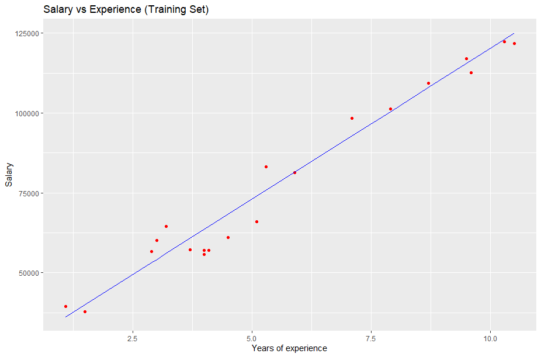
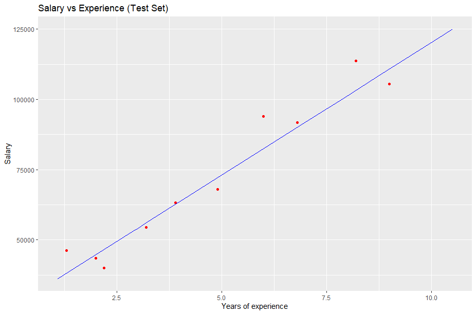

# Machine Learning
Machine Learning consists of a discipline of computer science, related to the development of Artificial Intelligence, and that serves to create systems that can learn by themselves.

It is a technology that allows a series of operations to be made automatic in order to reduce the need for human beings to intervene. This can be a great advantage when it comes to controlling a huge amount of information in a much more effective way.

What is called learning consists of the ability of the system to identify a large series of complex patterns determined by a large number of parameters.

That is, the machine does not learn by itself, but rather an algorithm of its programming, which is modified with the constant input of data into the interface, and which can, in this way, predict future scenarios or take actions automatically according to certain terms. As these actions are performed autonomously by the system, it is said that learning is automatic, without human intervention.

## Aplications
* Search engines.
* Speech and / or language recognition.
* Robotics
* Face detection.
* Anti-spam.
* Antivirus.
* Genetics.
* Weather prediction.
* Reading Comprehension.
* Autonomous vehicles and robots.
* High quality image analysis.
* Analysis of consumption and productivity behavior.

## What is linear regression for?
The regression model is often used in the Social Sciences in order to determine whether or not there is a causal relationship between a dependent variable (Y) and a set of other explanatory variables (X). Likewise, the model seeks to determine what the impact will be on variable Y in the event of a change in the explanatory variables (X).

## Observations from the linear regression plot generated in R

In this, the training data is used, as can be seen in the graph, some of the points are above the lines, especially three points. Others are further off the line. the blue line is the line estimated to have the results.


In this graph are the test points that we have, we can see that most are close to the line, only 1 point is above the line, while only 4 are far from the line, so the line is not giving bad predictions since most if they comply.

# Scale and Table Function

## Scale
scale is generic function whose default method centers and/or scales the columns of a numeric matrix.

### Usage
```R
scale(x, center = TRUE, scale = TRUE)
```
### Arguments
**x:** a numeric matrix(like object).

**center:** either a logical value or numeric-alike vector of length equal to the number of columns of x, where ‘numeric-alike’ means that as.numeric(.) will be applied successfully if is.numeric(.) is not true.

**scale:** either a logical value or a numeric-alike vector of length equal to the number of columns of x.

### Explain
The function what it does is to shape the dataset once it has been converted into a matrix, explaining in columns / lines it can show or distribute or accommodate the content.

## Table
table uses the cross-classifying factors to build a contingency table of the counts at each combination of factor levels.

### Usage
```R
table(…,
      exclude = if (useNA == "no") c(NA, NaN),
      useNA = c("no", "ifany", "always"),
      dnn = list.names(…), deparse.level = 1)
as.table(x, …)
is.table(x)

# S3 method for table
as.data.frame(x, row.names = NULL, …,
              responseName = "Freq", stringsAsFactors = TRUE,
              sep = "", base = list(LETTERS))
```
### Arguments

**…:** one or more objects which can be interpreted as factors (including character strings), or a list (or data frame) whose components can be so interpreted. (For as.table, arguments passed to specific methods; for as.data.frame, unused.)

**exclude:** levels to remove for all factors in …. If it does not contain NA and useNA is not specified, it implies useNA = "ifany". See ‘Details’ for its interpretation for non-factor arguments.

**useNA:** whether to include NA values in the table. See ‘Details’. Can be abbreviated.

**dnn:** the names to be given to the dimensions in the result (the dimnames names).

**deparse.level:** controls how the default dnn is constructed. See ‘Details’.

**x:** an arbitrary R object, or an object inheriting from class "table" for the as.data.frame method. Note that as.data.frame.table(x, *) may be called explicitly for non-table x for “reshaping” arrays.

**row.names:** a character vector giving the row names for the data frame.

**responseName:** The name to be used for the column of table entries, usually counts.

**stringsAsFactors:** logical: should the classifying factors be returned as factors (the default) or character vectors?

**sep, base:** passed to provideDimnames.