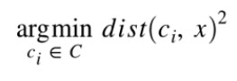
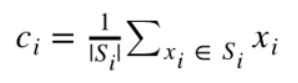
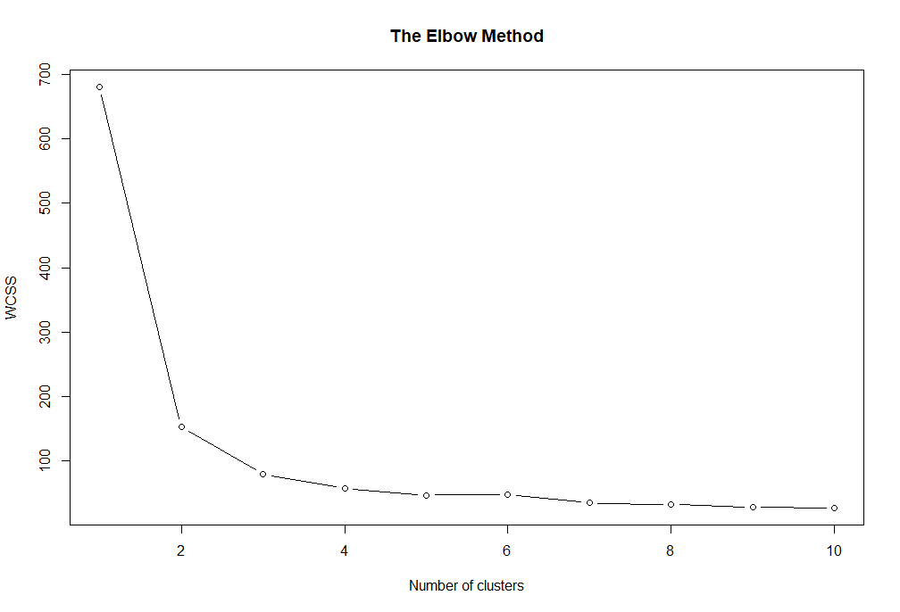
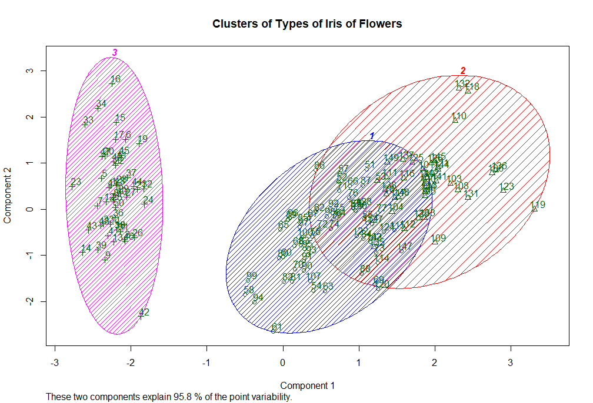

# Exam explanation
## Title page
 **TECNOLÓGICO​ ​NACIONAL​ ​DE​ ​MÉXICO**

**INSTITUTO TECNOLÓGICO DE TIJUANA**

**SUBDIRECCIÓN ACADÉMICA**

**DEPARTAMENTO DE SISTEMAS Y COMPUTACIÓN**

**SEMESTER: August - December 2020**

**CAREER: Computer Systems Engineer**

**SUBJECT: Data Mining**

**TITLE: Evaluation Practice Unit 4**

**UNIT TO BE EVALUATED: Unit 4**

**STUDENT NAMES AND CONTROL NUMBERS:**

**Moreno Ramos Emanuel - 16212046**

**Quiroz Vega Irving Arael - 15210341**

**TEACHER NAME:  JOSE CHRISTIAN ROMERO HERNANDEZ**

## Exam

### Introduction
Previously we had seen supervised machine learning algorithms, which one indicated what categories were with the training data, but sometimes there are so many data that it is better left to categorize them, for which there are unsupervised machine learning algorithms, which there are no categories, there are only independent variables, from this, patterns are sought in the data without making a specific prediction as an objective.
In this evaluation practice, K Means will be used, giving its explanation and then the exercise to be carried out will be shown.
### Developing
Develop the following problem with R and RStudio to extract the knowledge that the problem requires.

Implement the K-Means grouping model with the Iris.csv dataset found at https://github.com/jcromerohdz/iris using the kmeans () method in R. Once the grouping model is obtained do the corresponding data visualization analysis.

At the end of the development, explain in detail what the K-Means grouping model consists of and what were your observations in the data visualization analysis.
### K Means

K-Means is an unsupervised clustering algorithm. It is used when we have a lot of unlabeled data. The objective of this algorithm is to find “K” groups (clusters) among the raw data.

The algorithm works iteratively to assign each “point” (the rows of our input set form a coordinate) one of the “K” groups based on its characteristics. They are grouped based on the similarity of their features (the columns). As a result of executing the algorithm we will have:

The "centroids" of each group will be the "coordinates" of each of the K sets that will be used to label new samples.
Labels for the training dataset. Each label belongs to one of the K groups formed.

The groups are defined in an “organic” way, that is, their position is adjusted in each iteration of the process, until the algorithm converges. Once the centroids have been found, we must analyze them to see what their unique characteristics are, compared to that of the other groups. These groups are the labels that the algorithm generates.

The algorithm uses an iterative process in which the groups are adjusted to produce the final result. To execute the algorithm we must pass as input the data set and a value of K. The data set will be the characteristics or features for each point. The initial positions of the K centroids will be assigned randomly from any point in the input data set. Then it iterates in two steps:

#### 1.- Data Mapping Step
In this step, each “row” in our data set is assigned to the closest centroid based on the Euclidean square distance. The following formula is used (where dist () is the standard Euclidean distance):



#### 2.- Centroids update step
In this step the centroids of each group are recalculated. This is done by taking an average of all the points assigned in the previous step.



The algorithm iterates between these steps until it meets a stop criterion:
* If there are no changes in the points assigned to the groups,
* If the sum of the distances is minimized,
* A maximum number of iterations is reached.

### Code explain

First, the workspace to be used is indicated and the dataset containing the data for the width and height of the sepals and petals of different flowers is imported, so only the 4 columns are chosen.
```R
# Set our workspace
getwd()
setwd("D:/Usuarios/Emanuel/Descargas/Kmeans")
getwd()

# Importing the dataset
dataset = read.csv('iris.csv')
dataset = dataset[1:4]
````
The elbow method will be used to know in how many clusters it is the most optimal to divide, although it is known that it will be in 3, so it will only be used as a verification basis.
It is indicated that the random seed 6 will be used.
```R
set.seed(6)
````
A variable that has the form of a vector is declared.
```R
wcss = vector()
````
A for cycle is made, where the sum of errors of the group is stored in the variable, it can be said that it is cycled 10 times to see if between 1 to 10 clusters which is appropriate, taking the k means of for each iteration.
```R
for (i in 1:10) wcss[i] = sum(kmeans(dataset, i)$withinss)
````
What was obtained in the variable with plot is plotted, indicating that there are 10 elements, their type, title and the labels of the X and Y axis.
```R
plot(1:10,
     wcss,
     type = 'b',
     main = paste('The Elbow Method'),
     xlab = 'Number of clusters',
     ylab = 'WCSS')
````
Giving us this result:


As you can see, the elbow is generated at point 3, since 1 to 2 is a straight line and from 4 to 10 it remains with little variation, creating an almost straight line.

Once we check how many clusters it can be divided into, the k means is performed.
A new seed is chosen, this time 29.
```R
set.seed(29)
````
The result of the machine learning using the dataset and with 3 clusters is saved in the variable k means.
```R
kmeans = kmeans(x = dataset, centers = 3)
````
Now, it is only saved that each value to which cluster belongs.
```R
y_kmeans = kmeans$cluster
````
Once the K Means is done, it is graphed, for which the cluster library is used, so it is imported first.
```R
# Visualising the clusters
library(cluster)
````
Now, the cluster graph is made, indicating that the joining lines are not seen, it is seen which areas they cover, with different colors, showing which point is with its number, as well as different points according to the cluster to which it belongs, Last but not least is the title of the graph.
```R
clusplot(dataset,
         y_kmeans,
         lines = 0,
         shade = TRUE,
         color = TRUE,
         labels = 2,
         plotchar = TRUE,
         span = FALSE,
         main = paste('Clusters of Types of Iris of Flowers'))
````
Giving the following result:

### Conclusion
